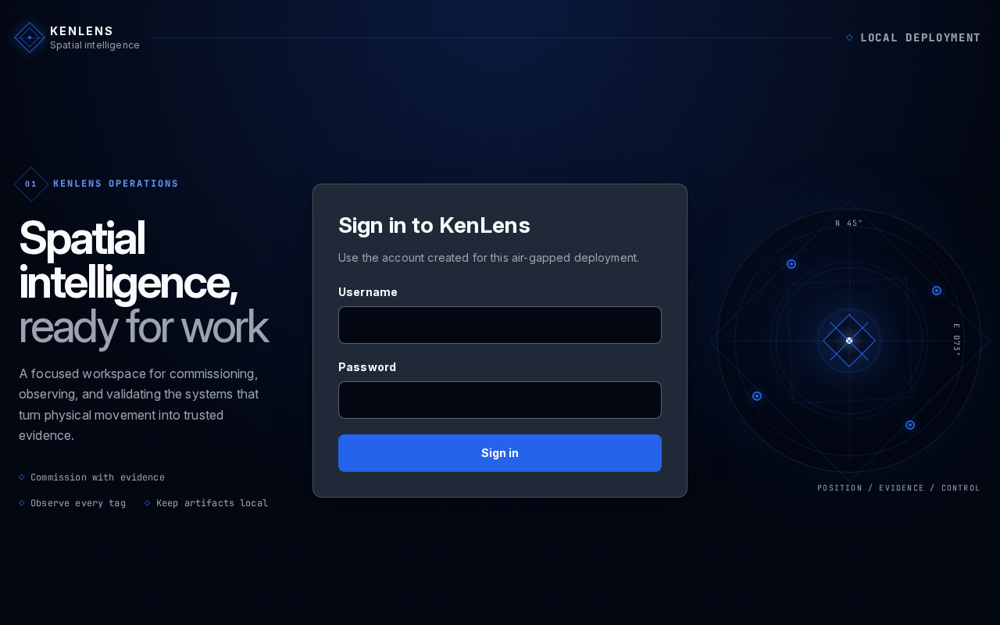

# KenLens — install bundle

KenLens is a self-hosted real-time location system. It listens to UWB measurements on an MQTT
broker and turns them into live positions, zones and alerts in the browser. This bundle runs it
on one host with Docker Compose: the KenLens server, a Mosquitto MQTT broker, a PostgreSQL
(TimescaleDB) database and an NTP service. Every image is public; no registry login is needed.
Each release is a [GitHub Release](https://github.com/kenlens-rtls/kenlens-deploy/releases) of
this repository with the bundle attached as `kenlens-deploy-vX.Y.Z.tar.gz`.

<p align="center">
  
</p>

- [Requirements](#requirements)
- [Ports](#ports)
- [Install](#install)
- [Uninstall](#uninstall)

## Requirements

**Host.** Any 64-bit Linux host that runs Docker, `amd64` or `arm64`. On a Raspberry Pi:

- a **Pi 4 or Pi 5 with at least 4 GB** of RAM — 8 GB is comfortable. The stack itself needs
  about 500 MB;
- **64-bit Raspberry Pi OS** — `uname -m` must print `aarch64`; there is no 32-bit image;
- an **SSD, not the SD card.** KenLens writes position history continuously, and an SD card
  wears out under that and is slow enough to hold the database back.

**Software.** Docker Engine with the Compose v2 plugin (`docker compose version` must work),
installed from [Docker's own packages](https://docs.docker.com/engine/install/) — the
distribution's `docker.io` package is often too old. Also `bash`, `openssl`, `curl` and `tar`,
which Raspberry Pi OS already has. Run everything below as a user in the `docker` group; the
setup script never needs `sudo`.

**Network.** Internet access while installing and upgrading — the images are pulled from
`ghcr.io` and Docker Hub. Give the host a fixed IP address (a DHCP reservation is enough) before
you install. **And give it one path to the anchors.** The host must answer an anchor by the same
route the anchor used to reach it. If the host also has an interface on the anchors' own network
(a Wi-Fi link beside its Ethernet port, say), either take that interface down or add a route to the
anchor network through the router, on the interface the anchors connect to. Otherwise a stateful
router between the two networks sees only half of every MQTT connection and drops it about a minute
after it opens, all day long: the anchors reconnect at once, so positions keep arriving, but every
anchor's **MQTT drops** count on the **Anchor fleet** page (the Anchors tile on the home page opens
it) keeps climbing. After the install, that count must stay flat for ten minutes.

**Decide two things first.** The setup script asks for both:

1. **The name or address** browsers will use to reach the host — a DNS name, a fixed IP, or
   both. It goes into the certificates; a name that is not in them makes browsers refuse the
   connection.
2. **The HTTPS port** — 8443 unless you want another, such as 443, which must be free on the
   host. It can be changed later.

## Ports

The host must accept:

| Port | Protocol | Who connects |
|---|---|---|
| 8443 | HTTPS | Browsers. The default; the setup script asks for another |
| 8883 | MQTT over TLS | UWB devices, with a username and password, and anything else with a broker account |
| 1883 | MQTT, plain TCP, anonymous | Nobody, by default. It is switched on in KenLens under **Configuration → MQTT broker**; it is unauthenticated and unencrypted, so only on a network you control |
| 123 | NTP (UDP) | UWB devices, to set their clocks. Nothing else on the host may already serve NTP |

## Install

Install into a directory you will keep — the examples use `/opt/kenlens`. Docker Compose
names the database volume after the directory, so an upgrade must happen in the same place.

```bash
# The latest release, or set VERSION=vX.Y.Z by hand for another one from the Releases page.
VERSION=$(curl -fsSL https://api.github.com/repos/kenlens-rtls/kenlens-deploy/releases/latest \
  | sed -n 's/.*"tag_name": *"\([^"]*\)".*/\1/p')
echo "$VERSION"

sudo mkdir -p /opt/kenlens && sudo chown "$USER": /opt/kenlens
cd /opt/kenlens
curl -fsSLO "https://github.com/kenlens-rtls/kenlens-deploy/releases/download/${VERSION}/kenlens-deploy-${VERSION}.tar.gz"
tar -xzf "kenlens-deploy-${VERSION}.tar.gz" --strip-components=1
```

**Prepare the host.** The setup script asks for the host name(s) and the HTTPS port:

```bash
./kenlens-setup.sh
```

or takes them from flags — repeat `--host` for every name and address:

```bash
./kenlens-setup.sh --host kenlens.example.lan --host 192.168.1.20 --https-port 443
```

It creates a private **KenLens CA** and the certificates it signs, every password and key the
stack uses, and `.env`. All of it lives under `config/` and in `.env`, is made once, and is never
overwritten by a later run. `./kenlens-setup.sh --help` lists every option.

**Start it:**

```bash
docker compose up -d --wait
```

The first start pulls the images and creates the database; `--wait` returns once every service
is healthy. Then check readiness from the host, against the KenLens CA, on the port you chose:

```bash
curl --cacert config/ca/kenlens-ca.crt https://kenlens.example.lan:8443/health/ready
```

`Healthy` means the server reaches both the database and the broker.

**First sign-in.** Browse to `https://<host>:8443`, or the port you chose. The browser warns about the certificate
until it trusts the KenLens CA: follow **Your browser warns about this site? Trust this KenLens**
on the page, which downloads the CA and shows the steps for that browser (the same page is
`https://<host>:8443/trust`, with no login). A new installation then asks you to **create the
first Admin** — KenLens ships no default account, and this page closes as soon as one user
exists. Sign in with it and follow the first-run wizard.

**Upgrade.** One command fetches a release's bundle, checks it, applies it over this directory
and restarts the stack. `.env` is only added to (its version line changes, and a release may add
a setting it introduced), and nothing under `config/` or `data/` is touched:

```bash
./kenlens-setup.sh --update latest       # or --update vX.Y.Z, from the Releases page
```

## Uninstall

```bash
cd /opt/kenlens
docker compose down          # removes the containers; keeps the database and broker volumes
docker compose down -v       # ...and deletes the database — every user, zone and position
sudo rm -rf /opt/kenlens     # certificates, secrets, settings, floor plans, logs
```

`down -v` and deleting the directory cannot be undone.
